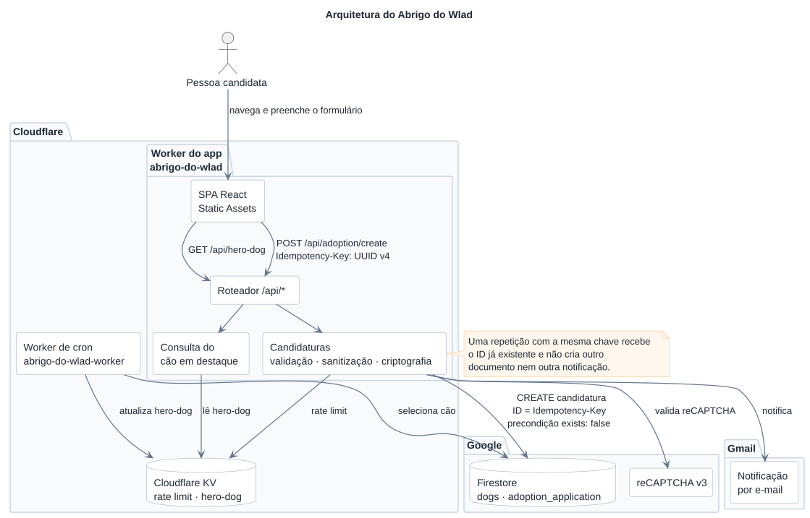

# Abrigo do Wlad - Plataforma Web

Repositório oficial do site do Abrigo do Wlad. Plataforma digital para divulgação de animais para adoção, campanhas de arrecadação e transparência das atividades do projeto social independente.

Este projeto foi criado para suprir uma necessidade crítica do projeto social independente: a listagem e divulgação de animais. Anteriormente, o abrigo utilizava arquivos em PDF para lidar com as adoções, um processo que se mostrava ineficiente e insustentável. Com a plataforma web, a iniciativa agora possui um catálogo dinâmico, acessível e de fácil manutenção.

Este projeto foi inicialmente desenvolvido como projeto acadêmico de extensão pela UNINTER, com foco em criar uma solução digital para ampliar a visibilidade, a organização e a eficiência das ações sociais do abrigo.

## Funcionalidades

- 🐶 **Vitrine de Adoção:** Catálogo digital completo e filtrável dos animais disponíveis, aposentando as antigas listagens em PDF.
- 📝 **Solicitação de Adoção:** Formulário multi-etapas (_Wizard_) intuitivo para avaliação de possíveis tutores, com criptografia dos dados sensíveis antes da persistência.
- ♻️ **Reciclagem Solidária:** Relação dos pontos de coleta parceiros para auxiliar nas arrecadações do abrigo.
- 🌓 **Acessibilidade e Usabilidade:** Suporte a tema claro/escuro nativo, animações fluidas e design responsivo.

## Tecnologias

- **React** e **TypeScript**
- **Vite** (Build tool)
- **CSS Modules** (Estilização escopada)
- **React Router** (Roteamento)
- **Lucide React** (Ícones)
- **Radix UI** (Componentes acessíveis)
- **Motion** (Animações)
- **Cloudflare Workers** (API, Static Assets e Cron Triggers)
- **Cloudflare KV** (cache compartilhado entre Workers)

## Identidade Visual

O tema visual foi apelidado de Jaci (do tupi Îasy e do guarani Jasy), em referência à [deusa da Lua](https://pt.wikipedia.org/wiki/Jaci). Suas cores remetem à Terra, com tons inspirados no céu, na água, no solo e na vegetação, somando a identidade já existente do Abrigo do Wlad. A paleta e os demais estilos globais estão centralizados em [`src/index.css`](src/index.css).

## Estrutura e Componentes

Abaixo está listada a estrutura atual do projeto:

```text
workers/
├── app/
│   └── index.ts               # Worker HTTP e roteador da API
├── cron/
│   ├── index.ts               # Worker exclusivo do Cron Trigger
│   └── wrangler.jsonc         # Configuração do abrigo-do-wlad-worker
└── shared/
    └── api/                    # Serviços compartilhados pelos dois Workers
        ├── _lib/               # Firestore REST, KV, segurança e e-mail
        ├── adoption/           # Submissão de candidatura
        ├── hero-dog/           # Leitura e atualização do destaque
        └── tests/              # Endpoint de debug local
public/
└── legal/
    └── privacy-policy.json
src/
├── assets/                   # Arquivos estáticos e metadados JSON
├── components/               # Componentes globais e reutilizáveis
│   ├── common/
│   ├── ui/
│   ├── Header/
│   ├── Footer/
│   └── ...
├── hooks/                    # Custom hooks
├── lib/                      # Utilitários e configs gerais
├── pages/                    # Páginas e rotas da aplicação
│   ├── About/
│   ├── BetaForm/
│   ├── Home/
│   ├── Legal/
│   └── Recycle/
├── services/
├── types/
├── utils/
├── routes.tsx
├── main.tsx
├── index.css
└── vite-env.d.ts
```

## Instalação e Execução

Para rodar o projeto localmente:

1.  Clone este repositório.
2.  Instale as dependências:
    ```bash
    npm install
    ```
3.  Configure as variáveis de ambiente. Para desenvolvimento local, use um arquivo `.env` na raiz. Para _deploy_, configure as mesmas chaves no painel do projeto.

    ```env
    NODE_ENV=development

    # Frontend
    VITE_FIREBASE_API_KEY=
    VITE_FIREBASE_AUTH_DOMAIN=
    VITE_FIREBASE_PROJECT_ID=
    VITE_FIREBASE_STORAGE_BUCKET=
    VITE_FIREBASE_MESSAGING_SENDER_ID=
    VITE_FIREBASE_APP_ID=
    VITE_RECAPTCHA_PUBLIC_KEY=

    # Runtime do Worker do app
    ALLOWED_ORIGIN=http://localhost:5173
    RECAPTCHA_SECRET_KEY=
    MASTER_KEY=

    # Firestore REST via service account (app e cron)
    FIREBASE_PROJECT_ID=
    FIREBASE_CLIENT_EMAIL=
    FIREBASE_PRIVATE_KEY=

    # E-mail / Admin
    GMAIL_USER=
    GMAIL_PASS=
    ADOPTION_EMAIL_RECIPIENT=
    DEBUG_EMAIL_RECIPIENT=
    ADMIN_PANEL_URL=
    ```

4.  Inicie o servidor local:

    ```bash
    npm run dev
    ```

5.  Para build de produção, use:

    ```bash
    npm run build
    ```

    O plugin Cloudflare gera o Worker do app, os Static Assets e uma configuração de deploy dentro de `dist/`. O comando `wrangler deploy` usa automaticamente essa configuração gerada.

## Arquitetura da API



> O diagrama é gerado a partir do fonte PlantUML em
[`docs/architecture.puml`](docs/architecture.puml).

O projeto possui dois Workers independentes:

1. `abrigo-do-wlad`: serve a SPA por Static Assets e executa as rotas `/api/*` em [workers/app/index.ts](workers/app/index.ts).
2. `abrigo-do-wlad-worker`: executa somente a atualização diária do cachorro em destaque, definida em [workers/cron/index.ts](workers/cron/index.ts).

Os dois Workers compartilham o mesmo namespace KV. Apenas o Worker de cron possui `triggers.crons`; o Worker do app não exporta um handler `scheduled`.

### Estrutura de rotas

- `GET /api/hero-dog` — retorna o cachorro em destaque
- `POST /api/adoption/create` — cria a submissão da adoção; exige um
  `Idempotency-Key` UUID v4 para que tentativas repetidas retornem a candidatura
  já criada sem duplicar o documento ou a notificação
- `GET /api/tests/email` — rota disponível somente com `NODE_ENV=development`

### Convenção de ambiente

Todos os módulos internos da API devem ler variáveis a partir do ambiente do runtime em execução, com suporte a fallback local para desenvolvimento:

```ts
const value = env?.MY_KEY ?? process.env.MY_KEY;
```

As variáveis `VITE_*` existem somente durante o build e são incorporadas ao frontend. Os Workers acessam o Firestore pela API REST, autenticada por OAuth 2.0 com uma service account. Credenciais do Firestore, reCAPTCHA, criptografia e e-mail são variáveis ou secrets de runtime configurados separadamente em cada Worker.

| Destino                                                 | Configuração necessária                                                                                                  |
| ------------------------------------------------------- | ------------------------------------------------------------------------------------------------------------------------ |
| Build do `abrigo-do-wlad` (`npm run build:app`)         | Todas as variáveis `VITE_*` do `.env.example`                                                                            |
| Runtime do `abrigo-do-wlad`                             | `NODE_ENV`, `ALLOWED_ORIGIN`, `RECAPTCHA_SECRET_KEY`, `MASTER_KEY`, credenciais Firestore REST e configurações de e-mail |
| Build do `abrigo-do-wlad-worker` (`npm run build:cron`) | Nenhuma variável `VITE_*`; o Wrangler empacota somente o código do cron                                                  |
| Runtime do `abrigo-do-wlad-worker`                      | `FIREBASE_PROJECT_ID`, `FIREBASE_CLIENT_EMAIL` e `FIREBASE_PRIVATE_KEY`; o binding `KV` já está no Wrangler              |

Os dois arquivos Wrangler usam `keep_vars: true` para preservar as variáveis configuradas pelo painel durante novos deploys. Valores sensíveis não devem ser adicionados aos arquivos Wrangler.

O código de runtime não utiliza `firebase-admin`. O cliente compartilhado em `workers/shared/api/_lib/firestore.ts` assina um JWT com Web Crypto, troca-o por um access token de curta duração e chama `firestore.googleapis.com` via `fetch`. O token é reutilizado enquanto estiver válido. `FIREBASE_PRIVATE_KEY` deve ser configurada como secret, nunca como variável de build ou valor versionado.

## Deploy

O Worker do app é o deploy principal conectado ao Git:

```bash
npm run deploy
```

O Worker de cron possui deploy separado:

```bash
npm run deploy:cron
```

No Workers Builds, configure cada Worker com comandos independentes:

| Worker                  | Build command        | Deploy command                                             |
| ----------------------- | -------------------- | ---------------------------------------------------------- |
| `abrigo-do-wlad`        | `npm run build:app`  | `npx wrangler deploy`                                      |
| `abrigo-do-wlad-worker` | `npm run build:cron` | `npx wrangler deploy --config workers/cron/wrangler.jsonc` |

O build do cron executa apenas um empacotamento de validação do Wrangler e, por isso, não carrega o Vite nem exige variáveis `VITE_*`. Não use comandos `wrangler pages` neste repositório.

## Autores

Desenvolvido e mantido por **[Alan](https://github.com/AlanClimaco)** e **[Luis](https://github.com/spantalho)**.

## Licença

Este projeto é de propriedade exclusiva do Abrigo do Wlad. O código-fonte está disponível para fins de estudo e manutenção, mas a utilização comercial ou réplica da identidade visual sem autorização prévia é vedada. Todos os direitos reservados.
