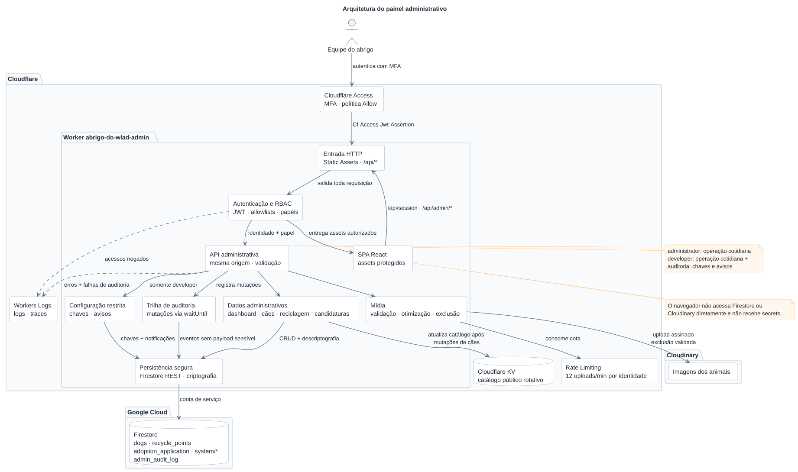

# Painel administrativo

Aplicação interna do Abrigo do Wlad para gerenciar animais, pontos de
reciclagem, candidaturas, imagens e avisos do painel.

## Arquitetura e segurança

O Cloudflare Access autentica o usuário, e o Worker valida o JWT e autoriza o
e-mail como `developer` ou `administrator`. O navegador não recebe credenciais
administrativas nem acessa o Firestore ou o Cloudinary diretamente.

Banco de dados, descriptografia e mídia passam pela API do Worker. Credenciais,
chaves e listas de e-mails autorizados ficam apenas no runtime. O roteiro de
configuração e publicação está em
[`docs/security/access-and-rules-rollout.md`](../../docs/security/access-and-rules-rollout.md).

```text
apps/admin/
├── public/       # Arquivos estáticos
├── src/          # SPA, componentes, páginas e cliente da API
├── worker/       # Autenticação, API, auditoria, mídia e notificações
├── package.json
└── wrangler.jsonc
```

Os componentes compartilhados vêm do workspace
[`@jaci/ui`](../../packages/ui).

### Diagrama



Fonte: [`docs/admin-architecture.puml`](../../docs/admin-architecture.puml).

## Desenvolvimento local

Execute os comandos na raiz do monorepo.

### Interface com dados simulados

```bash
npm run dev:admin:mock
```

Inicia apenas o Vite, sem `.env` ou serviços externos. A sessão usa o papel
`developer`, e as alterações ficam em memória até a página ser recarregada. O
cabeçalho identifica o modo com **Dados simulados**.

O mock só funciona no servidor de desenvolvimento e não cria bypass no Worker
ou nos builds de produção.

### Interface integrada ao Worker

```bash
npm install
npm run dev:admin
```

Inicia Vite e Worker na mesma origem, no ambiente `local`. Sem uma assertion
válida do Access, `/api/session` responde `401`; não há identidade simulada
nesse modo.

Use [`.dev.vars.example`](.dev.vars.example) como referência para a configuração
local. Valores reais devem permanecer em secrets de runtime e nunca ser
versionados.

## API administrativa

Todas as rotas exigem identidade válida do Cloudflare Access; mutações também
validam origem e payload.

| Recurso      | Rotas                                                     | Operações                                                 |
| ------------ | --------------------------------------------------------- | --------------------------------------------------------- |
| Sessão       | `/api/session`                                            | Identidade e papel atuais.                                |
| Dashboard    | `/api/admin/dashboard`                                    | Métricas, retenção e aviso ativo.                         |
| Animais      | `/api/admin/dogs[/:id]`                                   | Consulta e CRUD.                                          |
| Reciclagem   | `/api/admin/recycle-points[/:id]`                         | Consulta e CRUD.                                          |
| Candidaturas | `/api/admin/adoptions`, `/api/admin/adoptions/:id/status` | Consulta e atualização de status.                         |
| Auditoria    | `/api/admin/audit-log`                                    | Últimos 100 eventos; somente `developer`.                 |
| Mídia        | `/api/admin/media/upload`, `/api/admin/media/delete`      | Upload e exclusão validados.                              |
| Avisos       | `/api/admin/notifications`                                | Leitura geral; escrita e remoção somente por `developer`. |

Uploads aceitam uma imagem JPEG, PNG ou WebP de até 20 MB e 64 megapixels. O
Worker limita a versão persistida a 5 MB, tenta uma segunda otimização em WebP
quando necessário e aplica o limite de 12 uploads por minuto por identidade.

Avisos têm `message` (1–240 caracteres), `type` (`trivial`, `urgent`, `success`
ou `info`) e `expiration` (`1h`, `6h`, `12h` ou `until_deleted`). O Worker
calcula `expiresAt`; avisos vencidos deixam de aparecer automaticamente.

As principais mutações geram eventos em `admin_audit_log` sem copiar payloads,
candidaturas ou URLs de mídia. Mudanças em animais também agendam a reconstrução
do catálogo público no KV, que pode levar um breve período para convergir entre
regiões.

## Publicação

A configuração está em [`wrangler.jsonc`](wrangler.jsonc). Para verificar e
publicar o painel, siga o
[roteiro de publicação](../../docs/security/access-and-rules-rollout.md).
